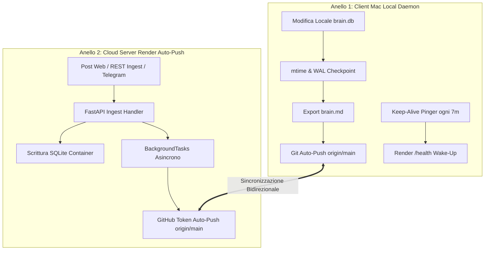

# 🧠 Universal AI Brain (Connettoma Cognitivo Universale)
> **Persistent Bi-Hemispheric Knowledge Graph, Hierarchical Tree Engine, Dual-Ring Cloud Persistence & MCP Server for Autonomous Multi-Agent AI Systems**  
> *100% Zero-Cost Architecture (0,00€ Forever) · FastAPI · SQLite WAL + FTS5 · Bidirectional BFS · Model Context Protocol (MCP) · Telegram Gateway · 24/7 Keep-Alive Daemon*

[](https://render.com/deploy)
[](LICENSE)
[](https://www.python.org/)
[](https://modelcontextprotocol.io/)
[](https://render.com)
[](https://universal-ai-brain.onrender.com)

---

## 🌌 1. Visione & Modello Bi-Emisferico

**Universal AI Brain** è il substrato di memoria persistente a lungo termine e navigazione associativa progettato per gli assistenti AI moderni (**Antigravity, Claude, Gemini, ChatGPT, Cursor**). Risolve il problema dell'amnesia tra sessioni fornendo una struttura a grafo neurale bi-emisferica ispirata alla neuroscienza cognitiva:

```
 ┌───────────────────────────────────────────┐       ┌───────────────────────────────────────────┐
 │     EMISFERO SINISTRO (⚡ Logic & Tech)     │       │    EMISFERO DESTRO (🌸 Art & Values)      │
 │     Colore: #00D2FF (Ciano / Blu Elettrico) │       │    Colore: #FF007F (Magenta / Rosa Neon)  │
 ├───────────────────────────────────────────┤       ├───────────────────────────────────────────┤
 │ • ARCHITECTURE      • COGNITIVE_RULE      │       │ • DESIGN_TOKEN      • EMOTIONAL_MEMORY    │
 │ • DATA_STRUCTURE    • MENTAL_MODEL        │◄═════►│ • COLOR_PALETTE     • LIFE_LESSON         │
 │ • ALGORITHM         • AI_REASONING        │ Corpo │ • UI_COMPONENT      • RELATIONSHIP        │
 │ • DEPENDENCY        • METACOGNITION       │Calloso│ • UX_FLOW           • PERSONAL_VALUE      │
 │ • BUSINESS_LOGIC    • USER_INTENT         │       │ • BRAND_VOICE       • CONVERSATION_EPISODE│
 │ • API_SPEC                                │       │ • CREATIVE_IDEA                           │
 └───────────────────────────────────────────┘       └───────────────────────────────────────────┘
```

### 🏛️ I 12 Macro-Domini Fondativi (Piano 0 - Attico Immutabile)
Il grafo è ancorato a 12 domini sigillati che fungono da radici ontologiche:
- **Sinistro (Scienza & Sistemi):** `domain-software-engineering`, `domain-ai-cognitive-systems`, `domain-medicina-salute`, `domain-scienza-matematica`, `domain-finanza-economia`, `domain-produttivita-sistemi`.
- **Destro (Umanità & Design):** `domain-design-creativita`, `domain-musica-audio`, `domain-filosofia-valori`, `domain-relazioni-comunicazione`, `domain-crescita-personale`, `domain-cultura-storia`.

### 🏢 Il Palazzo Cognitivo Verticale (Graph-of-Graphs a 3 Piani)
La conoscenza è stratificata gerarchicamente per evitare il sovraccarico di token negli LLM:
- **Piano 0 (Attico - Macro-Domini):** Le 12 aree fondative della conoscenza.
- **Piano 1 (Mezzanino - Progetti & Episodi):** Progetti software, repository, intenti utente (`USER_INTENT`), ragionamenti AI (`AI_REASONING`) ed episodi di dialogo (`CONVERSATION_EPISODE`).
- **Piano 2 (Piano Terra - Moduli Atomici):** Funzioni, componenti UI, token di design, regole cognitive e dettagli implementativi.

---

## ⚡ 2. Architettura Backend & Motore ad Alte Prestazioni

Il backend è sviluppato in **FastAPI** e **SQLite WAL**, combinando velocità sub-millisecondo con zero costi operativi:

```
                           ┌─────────────────────────────────────────┐
                           │            REST & MCP CLIENTS           │
                           │  (Web UI, Claude, Antigravity, Telegram)│
                           └────────────────────┬────────────────────┘
                                                │
                                                ▼
                           ┌─────────────────────────────────────────┐
                           │          FastAPI Gateway Server         │
                           │     (/api/graph/*, /api/memory/*)       │
                           └──────┬───────────────────────────┬──────┘
                                  │                           │
                                  ▼                           ▼
        ┌───────────────────────────────────┐       ┌───────────────────────────────────┐
        │       OptimizedBrainDB (Core)     │       │    Dual-Ring Persistence Engine   │
        │ • SQLite WAL + PRAGMA Concurrency │       │ • Client: sync_daemon.py (macOS)  │
        │ • FTS5 Unicode61 Search Index     │       │ • Server: BackgroundTasks Git Push│
        │ • Recursive CTE Hierarchy Engine  │       │ • Keep-Alive Pinger (Anti-Sleep)  │
        └───────────────────────────────────┘       └───────────────────────────────────┘
```

### 🔧 Ottimizzazioni di Basso Livello
1. **SQLite WAL (Write-Ahead Logging):**
   - Modalità `PRAGMA journal_mode=WAL;` con `PRAGMA synchronous=NORMAL;` e `busy_timeout=5000;`.
   - Consente letture concorrenti illimitate senza bloccare le transazioni di scrittura.
2. **Indice Full-Text FTS5 con Tokenizer Unicode61:**
   - Tabella virtuale `nodes_fts` per ricerche lessicali e semantiche ultra-rapide (<1ms) su `label`, `summary`, `tags` e `id`.
3. **Risoluzione Automatica Alias Domini (`DOMAIN_ALIASES`):**
   - Normalizza input eterogenei degli LLM (es. `domain-ai` ➔ `domain-ai-cognitive-systems`, `domain-coding` ➔ `domain-software-engineering`).
4. **Sanitizzazione & Traduzione CJK:**
   - Converte eventuali caratteri/token stranieri in Italiano con termini tecnici in Inglese standard.

---

## 🧮 3. Algoritmi Chiave del Connettoma

### ⚡ 1. Bidirectional Breadth-First Search (Cammini Minimi Sub-Millisecondo)
Calcola il percorso sinaptico più breve tra due concetti (es. un algoritmo in Emisfero Sinistro e un valore personale in Emisfero Destro) espandendo due frontiere simultanee da `source` e `target`:
- **Complessità Temporale:** $\mathcal{O}(b^{d/2})$ anziché $\mathcal{O}(b^d)$ del BFS classico.
- Attraversa istantaneamente i ponti del **Corpo Calloso** (`CORPUS_CALLOSUM_LINK`).

### 🌳 2. Recursive CTE Hierarchical Tree Explorer
Estrae la tassonomia ad albero multilivello con una singola query ricorsiva SQL:
- Struttura: `Radice ➔ Emisferi ➔ Domini (P0) ➔ Progetti/Episodi (P1) ➔ Moduli (P2)`.
- Riduce fino all'**85%** il consumo di context window dei modelli AI rispetto al dump del grafo completo.

### 🔍 3. GraphRAG Ibrido con Inibizione Interemisferica
Combina il punteggio BM25 di SQLite FTS5 con filtri emisferici selettivi (`LEFT` per puro focus logico-ingegneristico, `RIGHT` per focus creativo/valoriale, `ALL` per ragionamento olistico).

---

## 🛡️ 4. Sistema di Persistenza a Doppio Anello (Dual-Ring Persistence)

Universal AI Brain adotta un'architettura **lossless a doppio anello** che garantisce **zero perdita di memoria** anche in caso di riavvii del cloud o spegnimento del computer locale:



### 🍏 Anello 1: Demone macOS LaunchAgent (`com.universalbrain.sync`)
- **Percorso Esecutore:** Installato in `~/.local/bin/universal-brain-daemon` (evita i blocchi TCC sandbox di macOS su `~/Desktop`).
- **Zero Footprint:** Utilizza `<0.01%` CPU e `~35MB` RAM, monitorando l'evento `mtime` del file database e del journal WAL.
- **Heartbeat Anti-Sleep (Keep-Alive):** Invia un ping `GET /health` a Render ogni **7 minuti** (420s), impedendo lo spin-down del piano Free (che dorme a 15 minuti) e garantendo server attivo **24 ore su 24, 7 giorni su 7**.

### ☁️ Anello 2: Cloud Server Auto-Push su Render
- All'arrivo di un inserimento da Web Dashboard, Telegram Bot o chiamata cURL:
  1. Inserisce atomicamente nodi e archi nel database SQLite del container.
  2. Esegue il checkpoint del WAL ed esporta `brain.md`.
  3. Tramite `GITHUB_TOKEN`, avvia un task asincrono in background che committa e pusha immediatamente `brain.db` e `brain.md` su GitHub `origin/main`.
- **Garanzia:** Anche se il computer dell'utente è spento per settimane e Render viene riavviato, il container riparte sempre clonando l'ultimo database aggiornato da GitHub.

---

## 🎨 5. Frontend & Interfaccia Dark-Tech

La Web Dashboard (`static/index.html`) offre una visualizzazione cinematografica interattiva ad alto impatto estetico:

- **🕸️ Motore Graph Force-Directed 2D & 3D:** Nodi fluorescenti interattivi con fisica D3.js / Force-Graph, colori ciano `#00D2FF` (Sinistro) e magenta `#FF007F` (Destro), e archi curvilinei pulsanti per il Corpo Calloso.
- **🏢 Navigatore Piani Palazzo Cognitivo:** Switch istantaneo tra `Piano 0 (Attico Domini)`, `Piano 1 (Progetti)` e `Piano 2 (Dettagli)` con animazioni fluide.
- **🔍 Ricerca GraphRAG Real-Time:** Filtro per parola chiave, tassonomia ed emisfero con highlighting istantaneo dei nodi e centratura camera.
- **📥 Ingestione Rapida JSON & Manual Add:** Form modale per incollare blocchi JSON generati dagli LLM con preview e validazione immediata.
- **💻 Console Terminale Integrata:** Log in tempo reale degli eventi di sincronizzazione, chiamate API e checkpoint WAL.

---

## 📱 6. Gateway Telegram Serverless (`telegram_bot.py`)

Il bot Telegram (`@pier_brain_ai_bot`) consente di interagire con il connettoma in mobilità:
- **📥 Ingestione 1-Click:** Invia o inoltra qualsiasi blocco di codice ` ```json ` generato da Claude, Gemini o ChatGPT per inserirlo direttamente nel cervello.
- **⚡ Auto-Push Git:** Ogni inserimento da Telegram attiva istantaneamente l'auto-push su GitHub tramite l'Anello Cloud.
- **🔍 Comandi Rapidi:** `/stats` per le statistiche, `/tree` per l'albero di conoscenza, `/search <query>` per GraphRAG istantaneo.

---

## 🔌 7. Server MCP Nativo per AI Assistants (`mcp_server.py`)

Universal AI Brain espone un server standard **Model Context Protocol (JSON-RPC 2.0)** con 7 tool nativi per Claude Desktop, Antigravity e Cursor:

| Nome Tool MCP | Descrizione |
| :--- | :--- |
| `brain_get_stats` | Statistiche aggregate del connettoma (totale nodi, emisferi, ponti). |
| `brain_get_palazzo` | Vista strutturata a piani (P0 Macro-Domini, P1 Progetti, P2 Moduli). |
| `brain_get_tree` | Tassonomia ad albero gerarchico con conteggio nodi per categoria. |
| `brain_search` | Ricerca full-text GraphRAG BM25 con inibizione emisferica facoltativa. |
| `brain_get_node` | Dettaglio atomico di un nodo con summary, tags, details e sinapsi collegate. |
| `brain_shortest_path`| Calcolo del cammino minimo trans-emisferico tramite BFS bidirezionale. |
| `brain_ingest` | Ingestione atomica batch di nuovi nodi e archi con validazione tassonomica. |

---

## 🌟 8. L'Ecosistema Ubiquitous Supercervello (100% Zero-Cost)

Oltre al backend e alla sincronizzazione con Obsidian, il connettoma include un ecosistema completo ad attrito zero su macOS, Browser, Mobile e IDE:

| Modulo / Strumento | Percorso / File | Descrizione |
| :--- | :--- | :--- |
| **🚀 Raycast Extension** | `raycast/` | Quick-search FTS5, quick-add di note e cattura dagli appunti con scorciatoia `Cmd+Space`. |
| **🎙️ Siri & Apple Shortcuts** | `apple_shortcuts/` | Cattura vocale da iPhone, Apple Watch e Mac con auto-catalogazione via `/api/memory/voice-note`. |
| **🌅 Daily Pulse Telegram** | `sync_daemon.py` | Invio automatico alle 08:00 del briefing di 90 secondi (curva dell'oblio + modello mentale). |
| **🌐 Web Clipper (Safari & Chrome)** | `web_clipper/` | Estensione Manifest V3 per catturare articoli ed evidenziazioni con 1 click nel browser. |
| **📖 Kindle Sync Engine** | `kindle_sync.py` | Importazione ed estrazione idempotente a costo zero da `My Clippings.txt`. |
| **🌙 Consolidamento Notturno REM** | `brain_rem_cycle.py` | Demone notturno delle 03:00 per tessitura sinapsi, rilevamento contraddizioni e vacuum. |
| **🧠 Ricerca Vettoriale Ibrida** | `brain_vectors.py` | Fusione RRF tra lessicale (FTS5 BM25) e vettoriale (Cosine similarity su n-grammi densi). |
| **🛠️ IDE & Shell Auto-Hooks** | `ide_hooks/` | Iniezione contesto attivo pre-sessione e cattura automatica della Triade a fine lavoro. |
| **🎨 Obsidian Canvas Sync** | `obsidian_canvas_sync.py` | Mappa visiva 2D bi-emisferica a schede sincronizzata con `00_CONNETOMA_CANVAS.canvas`. |

---

## 🚀 9. Installazione Rapida in 1 Click (Mac / Linux)

Per configurare l'intero ambiente, il comando globale CLI, le skill AI e il demone LaunchAgent:

```bash
git clone https://github.com/PierfrancescoAmendola/Universal-AI-Brain.git
cd Universal-AI-Brain
chmod +x install.sh
./install.sh
```

### Comandi CLI Disponibili:
```bash
brain stats                 # Visualizza statistiche del connettoma
brain search "fastapi"      # Ricerca full-text FTS5
brain tree                  # Visualizza albero gerarchico di conoscenza
brain sync                  # Sincronizzazione bidirezionale immediata con Render
brain daemon status         # Mostra lo stato del demone macOS LaunchAgent
brain daemon logs           # Visualizza i log in tempo reale del demone
brain add "Titolo" "Sintesi"# Inserimento rapido di un nuovo nodo
brain open                  # Apre la Web Dashboard nel browser
```

---

## 🌐 10. Deploy su Render.com (0,00€ / Mese)


1. Fai il **Fork** di questo repository su GitHub.
2. Accedi a [dashboard.render.com](https://dashboard.render.com/) e crea un nuovo **Web Service**.
3. Collega il tuo repository: Render userà automaticamente il file `render.yaml` incluso.
4. Nelle **Environment Variables** di Render aggiungi:
   - `GITHUB_TOKEN`: tuo GitHub Personal Access Token con permessi `repo:write` (permette l'Auto-Push da cloud).
5. Il tuo cervello sarà operativo 24/7 con HTTPS, Web Dashboard, endpoint MCP e sincronizzazione automatica.

---

## 🤖 10. Il Protocollo Cognitivo Obbligatorio per Assistenti AI (`/universal-brain`)

Ogni assistente AI che collabora con Pierfrancesco Amendola segue il **Ciclo Cognitivo a 2 Fasi**:
1. **Fase 1 (Pre-Response Retrieval):** Prima di rispondere, interroga il connettoma (`brain_search`, `brain_get_tree`) per recuperare preferenze, vincoli e decisioni pregresse.
2. **Fase 2 (Post-Response Ingestion):** Al termine di ogni sessione, crea e persiste la Triade Obbligatoria:
   - `USER_INTENT` (Emisfero Sinistro / Piano 1)
   - `AI_REASONING` (Emisfero Sinistro / Piano 1)
   - `CONVERSATION_EPISODE` (Emisfero Destro / Piano 1)
   - 7 Sinapsi di collegamento con `person-pierfrancesco` e i progetti target.

---

## 📜 Licenza
Rilasciato sotto licenza **MIT**. Libero per uso personale, accademico e open-source.
