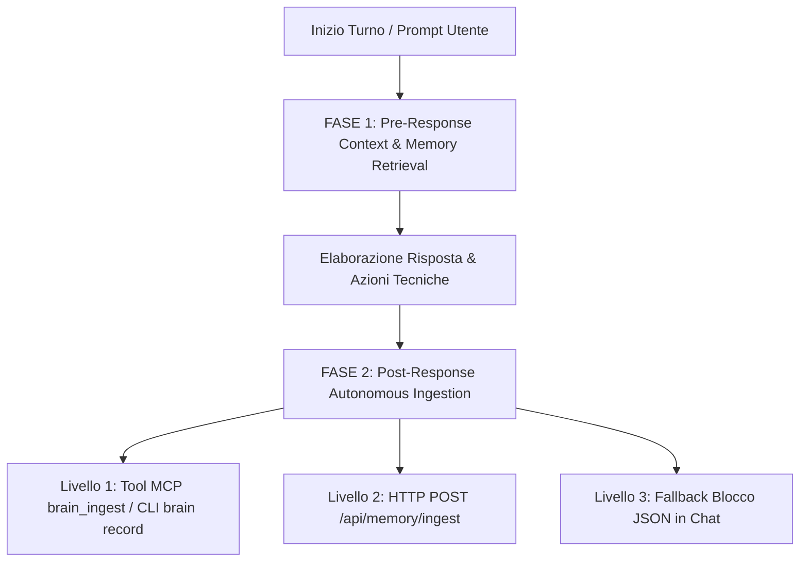

# Universal AI Brain Skill (`/universal-brain`)

Operates directly on the Persistent Bi-Hemispheric Knowledge Graph (`brain.db` and `https://universal-ai-brain.onrender.com`).

---

## 🏛️ CORE PROTOCOL: 2-PHASE COGNITIVE CYCLE

Ogni assistente AI che interagisce con Pierfrancesco Amendola **HA IL DOVERE ASSOLUTO** di seguire questo ciclo cognitivo a due fasi:



---

## 🔍 FASE 1: PRE-RESPONSE CONTEXT & MEMORY RETRIEVAL (GraphRAG)

Prima di formulare qualsiasi risposta o proposta architetturale, l'AI **interroga il cervello** per recuperare la memoria storica:
1. **Ricerca Preferenze & Decisioni Pregresse:**
   - Esegui `brain_search` (MCP) o `brain search "<keywords>"` (CLI) per individuare:
     - Preferenze storiche di Pierfrancesco (`person-pierfrancesco`).
     - Architetture, pattern e vincoli dei progetti attivi (es. `universal-ai-brain`, `project-royal-gambit-chess`, `proj-streaksup-app`).
     - Episodi conversazionali precedenti (`CONVERSATION_EPISODE`) e intenti (`USER_INTENT`) per garantire la **continuità cognitiva senza perdita di contesto**.
2. **Esplorazione Gerarchica & Palazzo Cognitivo:**
   - In caso di argomenti ampi, usa `brain_get_tree` per visualizzare la tassonomia ad albero o naviga per piani (`layer_level`: 0 = Attico Macro-Domini, 1 = Progetti & Episodi, 2 = Moduli Atomici).
3. **Ponti Sinaptici:**
   - Per collegare concetti tecnici (`LEFT`) a valori personali o design (`RIGHT`), calcola `brain_shortest_path` attraverso il Corpo Calloso.

---

## 💾 FASE 2: POST-RESPONSE AUTONOMOUS INGESTION (Continuità Cognitiva)

Al termine di ogni interazione, risoluzione di task, refactoring o decisione, l'AI **HA L'OBBLIGO TASSATIVO di catturare e persistere la sessione nel connettoma**.

### 1. La Triade di Sessione Obbligatoria:
1. **`USER_INTENT` (Emisfero Sinistro / Piano 1):**
   - `id`: `user-intent-<slug-kebab-case>`
   - `label`: Titolo chiaro dell'intento in italiano
   - `hemisphere`: `LEFT`
   - `primary_label`: `USER_INTENT`
   - `summary`: Sintesi dell'obiettivo operativo
   - `details`: `{"user_prompt": "<testo fedele>", "context": "<vincoli e contesto>"}`
   - `parent_graph_id`: ID del progetto o macro-dominio (es. `universal-ai-brain`)
   - `layer_level`: 1
2. **`AI_REASONING` (Emisfero Sinistro / Piano 1):**
   - `id`: `reasoning-<slug-kebab-case>`
   - `label`: Titolo del ragionamento e delle soluzioni adottate
   - `hemisphere`: `LEFT`
   - `primary_label`: `AI_REASONING`
   - `summary`: Sintesi tecnica delle decisioni, logiche e deduzioni
   - `details`: `{"model": "<Nome Modello>", "responses_given": "...", "actions_taken": [...], "outcome": "..."}`
   - `parent_graph_id`: ID del progetto
   - `layer_level`: 1
3. **`CONVERSATION_EPISODE` (Emisfero Destro / Piano 1):**
   - `id`: `episode-<slug-kebab-case>`
   - `label`: Titolo dell'episodio di dialogo
   - `hemisphere`: `RIGHT`
   - `primary_label`: `CONVERSATION_EPISODE`
   - `summary`: Sintesi olistica della conversazione
   - `details`: `{"participants": ["Pierfrancesco Amendola", "<Nome Modello>"], "topic": "...", "key_takeaways": "...", "pending_tasks": "..."}`
   - `layer_level`: 1
4. **Nodi Specialistici Aggiuntivi (se rilevanti):**
   - Nuovi componenti (`UI_COMPONENT`, `DESIGN_TOKEN`), architetture (`ARCHITECTURE`), algoritmi (`ALGORITHM`), regole (`COGNITIVE_RULE`), valori (`PERSONAL_VALUE`).

### 2. Le 7 Sinapsi Obbligatorie:
- `USER_INTENT` ➔ `person-pierfrancesco` (`EXPRESSED_BY`)
- `USER_INTENT` ➔ Progetto/Dominio (`TARGETS_PROJECT` o `TARGETS_DOMAIN`)
- `AI_REASONING` ➔ `USER_INTENT` (`FULFILLS`)
- `AI_REASONING` ➔ Progetto/Dominio (`OPTIMIZES` o `MODIFIES`)
- `CONVERSATION_EPISODE` ➔ `person-pierfrancesco` (`INTERACTION_WITH`)
- `CONVERSATION_EPISODE` ➔ `USER_INTENT` (`RECORDS_INTENT`)
- `CONVERSATION_EPISODE` ➔ `AI_REASONING` (`RECORDS_REASONING`)

---

## 🚀 GERARCHIA DI ESECUZIONE DELL'INGESTIONE (3 LIVELLI)

L'AI deve applicare il primo livello disponibile nel proprio ambiente operativo:

### 🟢 LIVELLO 1: Ambiente Locale con MCP o Accesso CLI (Antigravity, Cursor, Terminale)
- **Opzione A (Tool MCP):** Invoca direttamente il tool `brain_ingest` passando l'oggetto `{"nodes": [...], "edges": [...]}`.
- **Opzione B (Helper Rapido CLI):** Esegui il comando:
  ```bash
  brain record --prompt "<prompt>" --reasoning "<ragionamento>" --episode "<episodio>" --project "<project_id>"
  # oppure:
  python3 /Users/pierfrancesco/Desktop/CervelloArtificiale/sync_brain.py --record ...
  ```

### 🟡 LIVELLO 2: Ambiente con Accesso di Rete HTTP / cURL (Scripts, Cloud Bots, OpenAI Actions)
- Invia una chiamata HTTP POST immediata a Render:
  ```bash
  curl -X POST "https://universal-ai-brain.onrender.com/api/memory/ingest"        -H "Content-Type: application/json"        -d '{"nodes": [...], "edges": [...]}'
  ```

### 🔴 LIVELLO 3: FALLBACK OBBLIGATORIO PER WEB CHAT ISOLATE (Claude.ai, ChatGPT, Gemini Web)
Se l'AI opera all'interno di una web chat senza accesso a terminale, tool MCP o cURL di rete:
> **REGOLA TASSATIVA DI FALLBACK:**
> L'AI **DEVE STAMPARE IN CALCE ALLA RISPOSTA** il blocco di codice JSON formattato (````json ... ````) pronto per essere copiato e incollato con 1-click dall'utente nella Web Dashboard su `https://universal-ai-brain.onrender.com`.

Esempio del blocco JSON obbligatorio di fallback:
```json
{
  "nodes": [
    {
      "id": "user-intent-titolo-kebab",
      "label": "Titolo Intento Utente",
      "hemisphere": "LEFT",
      "primary_label": "USER_INTENT",
      "category": "USER_INTENT",
      "tags": ["tag1", "tag2"],
      "summary": "Sintesi chiara in italiano.",
      "details": {
        "user_prompt": "Prompt originario dell'utente",
        "context": "Contesto operativo"
      },
      "confidence": "EXTRACTED",
      "parent_graph_id": "universal-ai-brain",
      "layer_level": 1
    },
    {
      "id": "reasoning-titolo-kebab",
      "label": "Titolo Ragionamento AI",
      "hemisphere": "LEFT",
      "primary_label": "AI_REASONING",
      "category": "AI_REASONING",
      "tags": ["architettura", "soluzione"],
      "summary": "Sintesi del ragionamento e delle decisioni.",
      "details": {
        "model": "Gemini 3.7 Flash",
        "responses_given": "Sintesi delle spiegazioni fornite",
        "actions_taken": ["Azione 1", "Azione 2"],
        "outcome": "Risultato ottenuto"
      },
      "confidence": "INFERRED",
      "parent_graph_id": "universal-ai-brain",
      "layer_level": 1
    },
    {
      "id": "episode-titolo-kebab",
      "label": "Titolo Episodio Conversazionale",
      "hemisphere": "RIGHT",
      "primary_label": "CONVERSATION_EPISODE",
      "category": "CONVERSATION_EPISODE",
      "tags": ["chat", "continuità-cognitiva"],
      "summary": "Sintesi dell'interazione.",
      "details": {
        "participants": ["Pierfrancesco Amendola", "Gemini 3.7 Flash"],
        "topic": "Argomento trattato",
        "key_takeaways": "Lezione appresa",
        "pending_tasks": "Prossimi passi"
      },
      "confidence": "EXTRACTED",
      "parent_graph_id": "root",
      "layer_level": 1
    }
  ],
  "edges": [
    {"source": "user-intent-titolo-kebab", "target": "person-pierfrancesco", "relation": "EXPRESSED_BY", "confidence": "EXTRACTED", "reasoning": "Espresso da Pierfrancesco"},
    {"source": "user-intent-titolo-kebab", "target": "universal-ai-brain", "relation": "TARGETS_PROJECT", "confidence": "EXTRACTED", "reasoning": "Riferito al progetto target"},
    {"source": "reasoning-titolo-kebab", "target": "user-intent-titolo-kebab", "relation": "FULFILLS", "confidence": "INFERRED", "reasoning": "Soddisfa la richiesta utente"},
    {"source": "reasoning-titolo-kebab", "target": "universal-ai-brain", "relation": "OPTIMIZES", "confidence": "INFERRED", "reasoning": "Ottimizza il progetto"},
    {"source": "episode-titolo-kebab", "target": "person-pierfrancesco", "relation": "INTERACTION_WITH", "confidence": "EXTRACTED", "reasoning": "Dialogo con Pierfrancesco"},
    {"source": "episode-titolo-kebab", "target": "user-intent-titolo-kebab", "relation": "RECORDS_INTENT", "confidence": "EXTRACTED", "reasoning": "Registra l'intento"},
    {"source": "episode-titolo-kebab", "target": "reasoning-titolo-kebab", "relation": "RECORDS_REASONING", "confidence": "EXTRACTED", "reasoning": "Registra il ragionamento"}
  ]
}
```

---

## 🇮🇹 REGOLA DI LINGUA & TAXONOMY BLINDATA

1. **Italiano Obbligatorio (con Termini Tecnici Internazionali in Inglese):**
   - Tutte le label, i summary, i tag e i details devono essere sempre scritti in **Italiano**.
   - I termini tecnici di settore (es. *FastAPI, SQLite WAL, GraphRAG, Minimax bitboard*) rimangono in **Inglese**.
   - **MAI generare caratteri o testi in Cinese / Wenyan / CJK**.
2. **Tassonomie Ammesse:**
   - **Emisfero Sinistro (`LEFT`):** `ARCHITECTURE`, `DATA_STRUCTURE`, `ALGORITHM`, `DEPENDENCY`, `BUSINESS_LOGIC`, `API_SPEC`, `COGNITIVE_RULE`, `MENTAL_MODEL`, `AI_REASONING`, `METACOGNITION`, `USER_INTENT`.
   - **Emisfero Destro (`RIGHT`):** `DESIGN_TOKEN`, `COLOR_PALETTE`, `UI_COMPONENT`, `UX_FLOW`, `BRAND_VOICE`, `CREATIVE_IDEA`, `EMOTIONAL_MEMORY`, `LIFE_LESSON`, `RELATIONSHIP`, `PERSONAL_VALUE`, `CONVERSATION_EPISODE`.
3. **Macro-Domini & Creazione Dinamica:**
   - Domini esistenti: `person-pierfrancesco`, `domain-software-engineering`, `domain-ai-cognitive-systems`, `domain-medicina-salute`, `domain-filosofia-valori`, `domain-design-creativita`.
   - L'AI è **esplicitamente autorizzata** a creare nuovi macro-domini (`id: "domain-<nome>"`, `category: "ROOT_DOMAIN"`, `layer_level: 0`, `parent_graph_id: "root"`) collegandoli a `person-pierfrancesco` se l'argomento copre una nuova area di vita o conoscenza.
